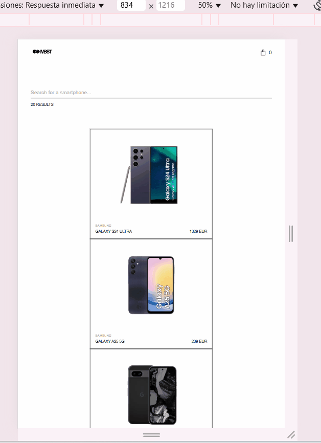
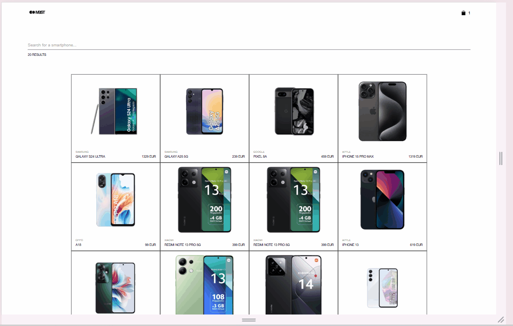

# Mobile Phone Catalog Web Application

## Demo

### Mobile


### Tablet


### Desktop


## Description

This project is a web application focused on visualizing, searching, and managing a catalog of mobile phones. The app allows users to view detailed information about each device and efficiently manage their shopping cart.

### Features:
- **Phone List View**: Displays a grid of phone cards showing the image, name, brand, and base price of each phone. Users can filter the phones by name or brand using a real-time search bar.
- **Phone Detail View**: Shows detailed information for each selected phone, including dynamic image selection, color, storage options, price updates, and technical specifications. Users can add the phone to the cart.
- **Shopping Cart View**: Displays the phones added to the cart with their image, name, specifications, and price. Users can remove items from the cart and view the total cost.

## Tech Stack

- **Frontend**: React.js (v17), Sass (for styling), React Context API for state management, and Jest for testing.
- **Backend**: Node.js (v18), with API integration for phone data.
- **Local Storage**: Used to persist the shopping cart data across page refreshes.

## Architecture

The project follows a **modular architecture** with the following structure:

```sh
    /pages                   # Pages (home, details, cart)
    /src
        /components          # Reusable components (cards, button, etc.)
        /contexts            # React contexts to manage cart and products
        /modules             # Feature-based modules containing related logic and components
        /services            # Services for communication with the API
        /utils               # Utility functions and helpers
    /styles                  # Global and specific styles for typographys, colors, spacings and borders
```
## Getting Started

Follow these steps to run the project locally.

### Prerequisites

Make sure you have the following installed on your system:

- [Node.js](https://nodejs.org/)
- [npm](https://www.npmjs.com/) or [yarn](https://yarnpkg.com/)

### Installation

Clone the repository and install the dependencies:

```sh
git clone git@github.com:smmu94/zara-web-challenge.git
cd zara-web-challenge
npm install  # or yarn install
```
### Running the Application

#### Development Mode

To start the application in development mode, run:

```bash
npm run dev
```
The app will be available at http://localhost:3000.

#### Production Mode

To build and run the production version:

```bash
npm run build
npm start
```

The production-ready app will be served on http://localhost:3000.

